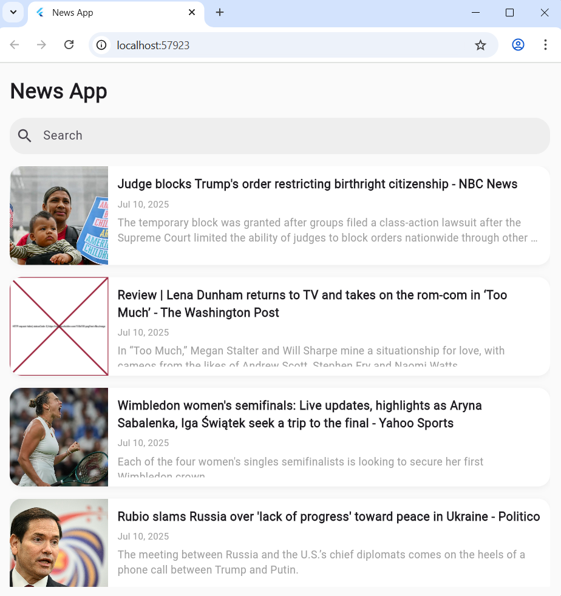
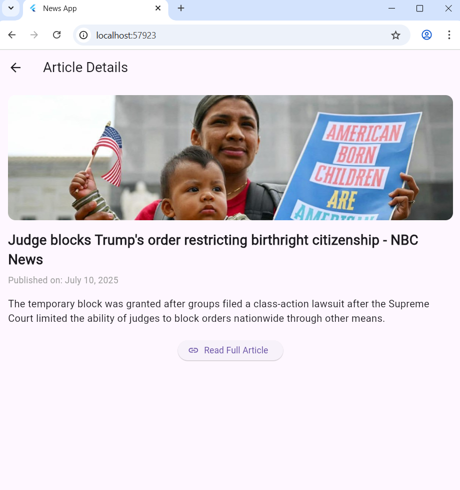

# 📰 Flutter News App

This is a simple and clean Flutter application that fetches and displays news articles using the [NewsAPI.org](https://newsapi.org) public API.

---

## 📱 Features

- Fetches top headlines from NewsAPI.
- Scrollable list of news articles.
- Each article shows:
  - 🖼️ Image (with fallback)
  - 🧾 Title
  - 🕒 Published Date
  - 📜 Short Description
- Search bar to filter articles by keywords.
- Tap any article to view full details and external link.
- Loading spinner and error messages included.

---

## 🔧 Technologies Used

- **Flutter**
- **HTTP package** for API calls
- **Intl package** for date formatting
- **State Management:** setState (no external library)
- **NewsAPI.org** for data source

---

## 📷 Screenshots

### 🏠 Home Screen


### 📄 News Detail Screen


## 🚀 Getting Started

### ✅ Prerequisites

- Flutter SDK installed
- NewsAPI API key from https://newsapi.org

### 🔨 How to Run

1. Clone the repository:

```bash
git clone https://github.com/Kezia-debug/flutter-news-app.git
cd flutter-news-app
